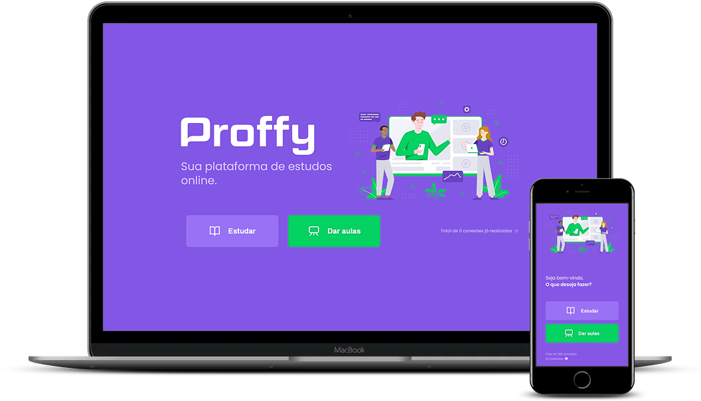

<h1 align="center">
    
    <br>Next Level Week #2<br/>
    Node.js | ReactJS | React Native
</h1>

<p align="center">
  
<p>

## Sobre
O **Proffy** foi desenvolvido para facilitar a comunicação entre alunos e professores particulares onde os professores possam cadastrar sua disciplina, disponibilidade de horário, valor da hora e também fornecer o seu contato para que possa ser exibido para os alunos nos filtros de busca.

## Tecnologias
- [TypeScript](https://www.typescriptlang.org/)
- [ReactJS](https://pt-br.reactjs.org/)
- [React Native](https://reactnative.dev/)
- [NodeJS](https://nodejs.org/en/)
- [Express](https://expressjs.com/)
- [Axios](https://github.com/axios/axios)
- [Expo](https://expo.io/)

## Como Executar

- ### **Pré-requisitos**

  - É **necessário** possuir o **[Node.js](https://nodejs.org/en/)** instalado no computador
  - É **necessário** possuir o **[Git](https://git-scm.com/)** instalado e configurado no computador
  - Também, é **preciso** ter um gerenciador de pacotes seja o **[NPM](https://www.npmjs.com/)** ou **[Yarn](https://yarnpkg.com/)**.
  - Por fim, é **essencial** ter o **[Expo](https://expo.io/)** instalado de forma global na máquina

1. Faça um clone do repositório:

```sh
  $ git clone https://github.com/lucasbrafer/Proffy.git
```

2. Executando a API:

```sh
  # Diretório da API
  $ cd server
  # Instalando as dependências do projeto.
  $ yarn # ou npm install
  # Configurando o banco de dados e criando as tabelas.
  $ yarn knex:migrate # ou npm run knex:migrate
  # Inicie a API
  $ yarn start # ou npm start
```

3. Executando a Aplicação Web:

```sh
  # Diretório Web
  $ cd web
  # Instalando as dependências do projeto.
  $ yarn # ou npm install
  # Inicie a aplicação web
  $ yarn start # ou npm start
```

4. Executando a Aplicação Mobile:

```sh
  # Diretório Mobile
  $ cd mobile
  # Instalando as dependências do projeto.
  $ yarn # ou npm install
  # Inicie a aplicação mobile
  $ yarn start # ou npm start
```

## Licença
Este projeto está sob a Licença [MIT](LICENSE.md)
<sup>Projeto desenvolvido com a tutoria de [Diego Fernandes](https://github.com/diego3g), da [Rocketseat](rocketseat.com.br).</sup>
